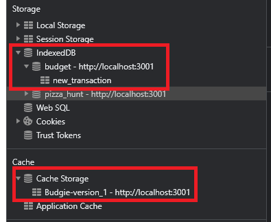

# Budget Tracker Starter Code  ~ Budige ~  (PWA)

## [Link to heroku](https://gorgeous-channel-islands-72248.herokuapp.com/)
## Summary

This weeks project entails taking an existing application and Express.js server, and adding offline persistence and functionality to it, by saving inputs via IndexedDB and saving the app itself using service-workers to cache the relevant files. Finally, the extant application is converted into a Progressive Web Application (PWA) for ease of use.

### Usage

To run locally, download/clone the source code and run 'npm start' in the terminal, from the root
 -OR- 
[Click this link, and then click on the icon in the right side of the URL bar that says 'Install Budgie'](www.google.com)

### Screenshots

 
Cache and IndexedDB for this app visible in the picture above  
 
Service Worker shown above  
 
What the app looks like when run from install

### Resources Used

[web.dev Manifest Guide](https://web.dev/add-manifest/) 
Module 18 
Module 19 
